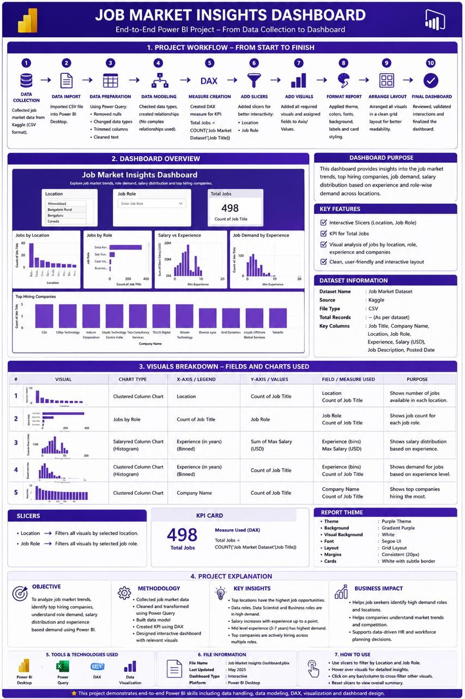
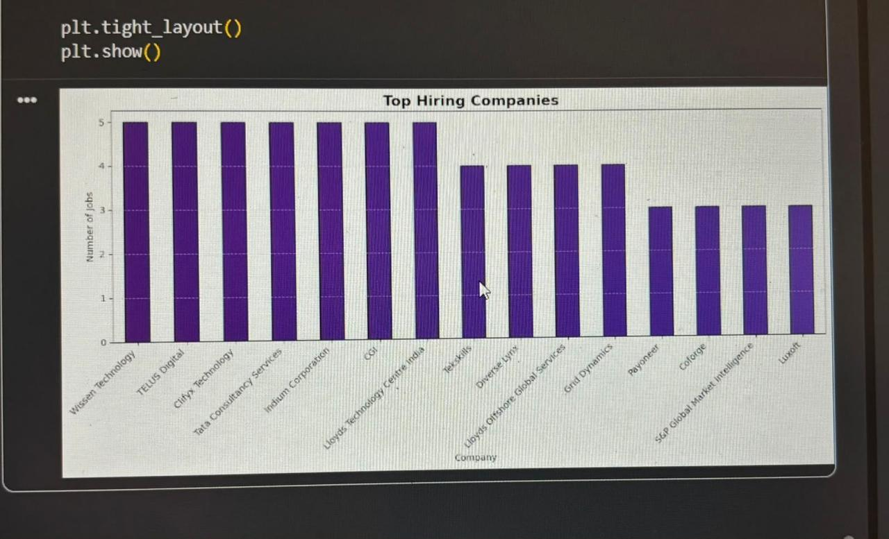
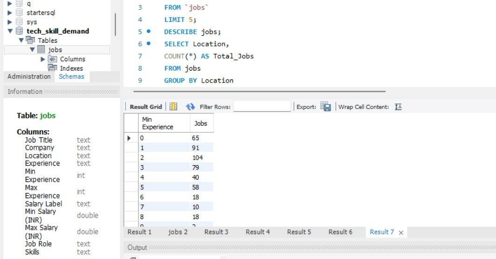
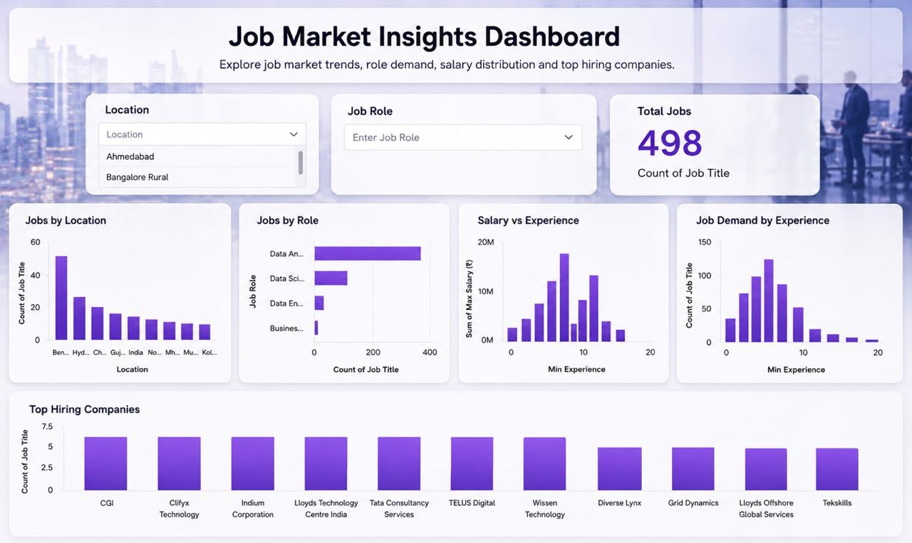

# Tech-Skill-Demand-and-Analysis
Analysis of in-demand technical skills using job market data
# Tech Skill Demand & Analysis

## Project Overview

This project analyzes job market data to understand job demand, technical skill requirements, salary trends, experience requirements, and hiring patterns.

The project follows an end-to-end workflow from data collection and cleaning to SQL analysis, Python-based exploratory analysis, and Power BI dashboard development.

## Technologies Used

* Python
* Pandas
* NumPy
* Matplotlib
* SQL
* MySQL
* Power BI
* Apify

## Project Workflow



**Workflow:** Data Collection → Data Cleaning → Data Processing → SQL Analysis → EDA → Power BI Dashboard → Insights

## Dataset

The dataset contains job listing information such as:

* Job Title
* Company
* Location
* Experience
* Minimum & Maximum Salary
* Job Role
* Technical Skills

The project uses both raw and cleaned datasets for analysis.

## Data Analysis

### Python

Python and Pandas were used for:

* Data loading
* Data cleaning
* Handling missing values
* Removing duplicate records
* Selecting relevant columns
* Preparing the final dataset
* Exploratory data analysis



### SQL

SQL was used to analyze the job dataset and extract insights related to:

* Job demand by location
* Job demand by experience
* Job roles
* Hiring companies
* Salary and experience



## Power BI Dashboard

An interactive Power BI dashboard was created to visualize:

* Total number of jobs
* Jobs by location
* Jobs by role
* Salary vs. experience
* Job demand by experience
* Top hiring companies



## Key Insights

The analysis focuses on identifying:

* In-demand job roles
* Technical skill requirements
* Locations with higher job demand
* Experience requirements
* Salary trends
* Top hiring companies

## Project Structure

```text
Tech-Skill-Demand-and-Analysis/
│
├── README.md
├── python/
│   └── analysis.ipynb
├── sql/
│   └── analysis.sql
├── dashboard_final.png
├── projectflow.jpeg
├── python_analysis.png
├── sql_analysis.png
├── raw_dataset.csv
└── final_clean_dataset.csv
```

## Author

**Aditya Vinayak Mahale**

B.Tech – Electronics & Telecommunication Engineering
